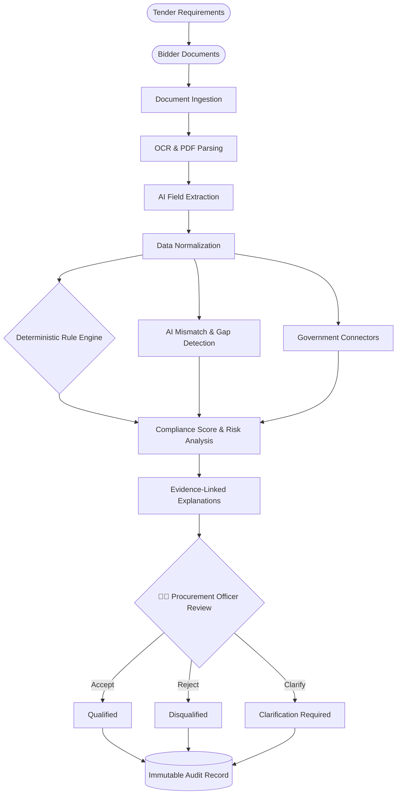

<div align="center">
  <h1>🇮🇳 Bid Compliance Platform</h1>
  <h3>AI-Powered Integrated Bid Compliance Verification Platform for GeM Procurement</h3>

  [](https://sih.gov.in)
  []()
  []()
  []()

  <p align="center">
    <strong>An AI-assisted procurement intelligence platform that transforms complex tender and bidder document verification into a structured, evidence-backed, auditable compliance workflow — while keeping the final decision in the hands of the Procurement Officer.</strong>
  </p>

  <p align="center">
    Built for the <strong>Ministry of Petroleum & Natural Gas / Chennai Petroleum Corporation Limited (CPCL)</strong> by team <strong>Git Push Force</strong>.
  </p>
</div>

---

## 📖 Project Overview

### What is this project?
The **Bid Compliance Platform** automates the labor-intensive process of verifying bidder compliance in government (GeM) procurement. It ingests complex bidder documents (PDFs, scans, certificates), extracts key information using advanced Document AI and OCR, cross-verifies it against deterministic rules and simulated government registries (GSTN, PAN, UDYAM, EPFO), and highlights risks or inconsistencies using semantic AI. 

Crucially, it acts as an **intelligence multiplier**, not an autopilot. It scores compliance, surfaces linked evidence, and generates cryptographic audit trails, while ensuring the **Procurement Officer** retains the final authority to accept, reject, or request clarifications.

---

## 🧩 The Real-World Problem

When a government organization publishes a large tender, multiple vendors submit hundreds of pages of documentation:
- GST documents & PAN cards
- Udyam/MSME certificates
- Financial statements & turnover declarations
- OEM authorizations and local-content (MII) declarations
- Statutory certificates (EPFO, ESIC, etc.)

**The Manual Nightmare:**
A procurement officer must manually read the tender clauses, sift through unstructured bidder documents, extract critical values, check external government portals for validity, and compare scattered information to find discrepancies. 

This process is slow, prone to human error, difficult to audit, and susceptible to fraud when inconsistencies (like mismatched PAN numbers across documents or inflated turnover figures) slip through the cracks.

---

## ⚖️ Problem Statement vs Our Solution

| Problem Statement Requirement | Our Approach |
|---|---|
| **Multi-portal verification** | Integrated sandbox connectors for GST, PAN, UDYAM, EPFO, ESIC, etc. |
| **Document verification** | AI-driven OCR + structured field extraction (regex & heuristic NLP). |
| **Compliance checking** | Deterministic rule engine evaluating conditions (e.g., Turnover > X). |
| **AI verification** | AI-assisted anomaly detection and semantic mismatch identification. |
| **Missing information** | Automated gap detection identifying mandatory missing documents. |
| **Inconsistent information** | Cross-document mismatch detection (e.g., differing company names). |
| **Risk assessment** | Multi-factor risk classification (LOW/MEDIUM/HIGH/CRITICAL). |
| **Compliance score** | Weighted, structured scoring mechanism for instant bidder triage. |
| **Explainability** | All AI and rule findings are strictly linked to source document evidence. |
| **Auditability** | SHA-256 cryptographic hash-chained audit trail for tamper-evident history. |
| **Human decision** | The Procurement Officer remains the final authority with override capabilities. |

---

## 🚀 What Makes Bid Compliance Platform Different?

1. **Hybrid Verification (The Best of Both Worlds)**  
   We do not rely solely on an unpredictable LLM to make decisions. We use AI for unstructured extraction and semantic reasoning, but route critical thresholds and logic through a **deterministic rule engine**.
2. **Evidence-First AI**  
   Every flag, mismatch, or compliance score is backed by a specific page, bounding box, or extracted value. No black-box decisions.
3. **Human-in-the-Loop**  
   The platform is an assistant. AI surfaces insights and risks; the Officer makes the legally binding decision.
4. **Cryptographic Auditability**  
   Every action—from AI extraction to an Officer overriding a rule—is logged in a tamper-evident SHA-256 hash chain, ensuring absolute accountability for government audits.
5. **Government Procurement Focus**  
   This is not a generic PDF chatbot. The workflows, rules, and data structures are explicitly modeled around GeM (Government e-Marketplace) constraints.

---

## 🔄 Complete End-to-End Workflow



---

## 🏗️ System Architecture

- **Frontend (Next.js 14, React 18, Tailwind CSS, Three.js):** Provides a high-performance, responsive, and visually premium dashboard for the Procurement Officer. Includes interactive 3D visualizations for compliance intelligence.
- **Backend (FastAPI, Python 3.11):** High-throughput, async API layer managing business logic, document queues, and integrations.
- **Database (SQLite/SQLAlchemy):** Relational storage for users, tenders, bids, rules, extracted fields, and verification records.
- **AI/OCR Service:** Pluggable AI service utilizing regex/heuristic pattern matching (currently local/mocked for sandbox, built to easily swap in external LLMs/Vision models).
- **Rule Engine:** Evaluates structured data against tender-specific requirements (e.g., minimum turnover, mandatory documents).
- **Audit Chain Layer:** SHA-256 hash-chained append-only log for tamper-evident tracking.
- **External Connectors (Simulated):** Mock endpoints simulating responses from GSTN, PAN, UDYAM, EPFO, and ESIC databases.

---

## 🛠️ Tech Stack

| Layer | Technology | Purpose |
|---|---|---|
| **Frontend** | Next.js 14, React, Tailwind | Server-rendered UI, Dashboard, Routing |
| **3D / Visuals**| Three.js, React Three Fiber| Interactive compliance network visualization |
| **Backend** | FastAPI, Python | Async REST APIs, Business Logic |
| **Database** | SQLite (SQLAlchemy ORM) | Relational persistent storage |
| **OCR / Parsing**| PyPDF | Raw text extraction from bidder PDFs |
| **AI / NLP** | Python `difflib`, Regex | Semantic matching, field extraction, anomaly detection |
| **Audit** | SHA-256 Hash Chaining | Tamper-evident cryptographic audit logs |
| **Authentication**| JWT (Passlib/Bcrypt) | Secure RBAC (Procurement Officer / Admin) |

---

## ✨ Feature Breakdown

### 1. Document Ingestion & AI Extraction
Uploads are processed asynchronously. PyPDF extracts text, and the AI module classifies the document (e.g., "GST Certificate", "Turnover Declaration") and extracts critical fields (Company Name, GSTIN, Values).

### 2. Hybrid Verification Engine
Structured data is passed to the **Deterministic Rule Engine** (checking if turnover > minimum required) and the **AI Service** (checking for semantic mismatches, like "Acme Corp" vs "Acme Corporation" across different documents).

### 3. Simulated Government Connectors
The platform automatically verifies extracted IDs (UDYAM, PAN, GSTIN) against simulated government endpoints to ensure the documents are genuine and active.

### 4. Risk Classification & Compliance Scoring
Bids are scored out of 100 based on fulfilled requirements. Bids with major discrepancies (e.g., differing PANs across documents) are flagged as **HIGH/CRITICAL RISK**.

### 5. Cryptographic Audit Trail
Every system action, AI finding, and Officer decision is hashed against the previous event's hash (`prev_hash + payload -> new_hash`). If a database row is manually altered, the chain breaks, instantly revealing tampering.

### 6. Interactive 3D Intelligence Dashboard
A premium UI featuring a 3D visualization of the compliance verification network, providing an intuitive overview of system health and processing layers.

---

## 🧠 Project Complexity

This is a highly complex project, bridging the gap between unstructured data and strict government regulations.

### 1. Document Complexity
Bid documents are notoriously messy. They are multi-page, scanned, poorly formatted, and lack standard layouts. Extracting a reliable "Turnover" figure requires robust pattern matching and confidence scoring.

### 2. Data Contradictions
A bidder might submit a GST certificate saying "XYZ Tech" and a PAN saying "XYZ Technologies". The system must use semantic similarity to flag this as a potential anomaly without failing it outright.

### 3. Rule Engine Flexibility
Tender A might require 2 years of operation and 50 Lakhs turnover. Tender B might require 5 years and 2 Crores. The rule engine dynamically adapts to the specific requirements of the parent Tender.

### 4. Audit & Legal Complexity
Procurement decisions are subject to RTI (Right to Information) and CAG audits. Therefore, the AI cannot be a "black box". Every AI decision must be linked to evidence, and the final human decision must be cryptographically locked.

---

## ⚙️ Complexity Pipeline

```mermaid
flowchart LR
    Raw[Raw PDF] --> Classify[AI Classification]
    Classify --> OCR[Text Extraction]
    OCR --> NLP[Entity Recognition]
    NLP --> Gov[Registry Verification]
    Gov --> Rule[Threshold Rules]
    Rule --> Cross[Cross-Document Semantics]
    Cross --> Score[Risk Scoring]
    Score --> Human[Officer Review]
    Human --> Hash[SHA-256 Chain]
```


*The pipeline moves from unstructured chaos (Raw PDF) to strict, mathematical accountability (Hash Chain).*

---

## 📖 Real-Life Example

**Scenario:** Tender requires a Minimum Turnover of ₹1 Crore and a valid GSTIN.
1. **Bidder submits:** A 50-page PDF containing a turnover declaration and a GST certificate.
2. **AI Action:** Extracts Turnover = ₹1.2 Crore, and GSTIN = `22AAAAA0000A1Z5`.
3. **Rule Engine:** `1.2 Cr >= 1.0 Cr` ➡️ **✅ PASS**.
4. **Gov Connector:** Pings GSTN API. Returns: `Status: Active`. ➡️ **✅ PASS**.
5. **AI Contradiction Check:** Notices the Company Name on the GST certificate is "Alpha Tech", but the PAN card says "Beta Industries". ➡️ **❌ HIGH RISK MISMATCH**.
6. **Officer Action:** Officer reviews the flagged mismatch, realizes they are separate entities, and hits "Disqualify". Action is cryptographically hashed into the Audit Log.

---

## ⚖️ Before vs After

### Traditional Process ❌
Tender → Read 100s of pages → Manually check Udyam portal → Manually check GST portal → Make notes in Excel → Hope nothing was missed → Create manual report. *(Days to weeks).*

### Bid Compliance Platform ✅
Tender → Drag & Drop Documents → System auto-extracts, auto-verifies, auto-cross-checks → Dashboard highlights 1 critical risk → Officer reviews evidence and makes decision. *(Minutes).*

---

## 🖥️ Dashboard & UI/UX

**Design Philosophy:** A premium, "dark enterprise" aesthetic that looks like a modern fintech or cyber-security platform, tailored for government procurement.
- **High-Contrast Indicators:** Clear visual separation of Compliant (Green), Medium Risk (Yellow), and High Risk (Red).
- **Executive Summary Cards:** Instant view of Total Bids, Pending Reviews, and Disqualified counts.
- **3D Interactive Visualizations:** Adds depth to the login and dashboard experiences, visually communicating the complex "Intelligence Network" running behind the scenes.

---

## 🔐 Security & Audit Architecture

- **Authentication:** JWT-based stateless authentication with `Passlib/Bcrypt` password hashing.
- **RBAC:** Strict Role-Based Access Control (Admin vs Procurement Officer).
- **Cryptographic Audit:** The `app/audit_chain` module implements an append-only, SHA-256 hash chain (`GENESIS_HASH` → `Event 1` → `Event 2`). 

---

## 🤖 Why We Don't Depend Only on AI

AI hallucinates. In government procurement, a hallucination can lead to a lawsuit. 

Our **Hybrid Approach** ensures AI is only used where it excels (semantic extraction, contradiction detection). We **never** use AI to determine if `5 > 3`. That logic is routed to the deterministic rule engine. 

Furthermore, the system is strictly **Human-in-the-Loop**. AI advises; the Procurement Officer decides.

---

## 🔌 API Documentation (Examples)

*Important endpoints available in the FastAPI backend:*

- `POST /api/v1/auth/login` - JWT Authentication
- `GET /api/v1/tenders/` - List active tenders
- `POST /api/v1/tenders/{id}/bids` - Create a new bid
- `POST /api/v1/documents/upload` - Ingest bidder documents for OCR
- `GET /api/v1/bids/{id}/verification` - Trigger rule engine and AI verification
- `GET /api/v1/audit/chain` - Verify the cryptographic integrity of the audit log

---

## 🗄️ Database Schema Overview

- **Users:** Authentication and Role management.
- **Tenders & TenderRequirements:** Stores the parent procurement parameters and dynamic rules.
- **Bidders & Bids:** Represents the vendor and their specific application to a Tender.
- **Documents & ExtractedFields:** Stores file metadata, OCR text, and the structured key-value pairs pulled by the AI.
- **Verifications:** Logs responses from external government sandboxes.
- **AuditEvents:** The immutable ledger of system and human actions.

---

## 📂 Folder Structure

```text
Gem-Bid-Compliance-AI/
├── frontend/                 # Next.js 14 Frontend Application
│   ├── public/               # Static assets & 3D models
│   ├── src/
│   │   ├── app/              # Next.js App Router (Pages, Layouts)
│   │   ├── components/       # UI Components, 3D Canvas, Dashboard Cards
│   │   └── lib/              # Frontend utilities & API hooks
│   ├── tailwind.config.ts    # Styling configuration
│   └── package.json          
├── backend/                  # FastAPI Python Backend
│   ├── app/
│   │   ├── ai/               # OCR & AI Extraction / Contradiction Logic
│   │   ├── audit_chain/      # SHA-256 Cryptographic Ledger
│   │   ├── connectors/       # Sandbox endpoints for Govt Portals (GST, PAN)
│   │   ├── routers/          # API Endpoints (Auth, Tenders, Bids, etc.)
│   │   ├── rules/            # Deterministic Rule Engine
│   │   ├── services/         # Core business logic layer
│   │   ├── database.py       # SQLAlchemy setup
│   │   ├── models.py         # DB Schemas
│   │   └── main.py           # FastAPI Application Entrypoint
│   ├── requirements.txt      
│   └── gem_compliance.db     # SQLite Database
└── README.md                 # You are here
```

---
<p align="center">
  <i>Built with ❤️ by Git Push Force for Smart India Hackathon 2026</i>
</p>
